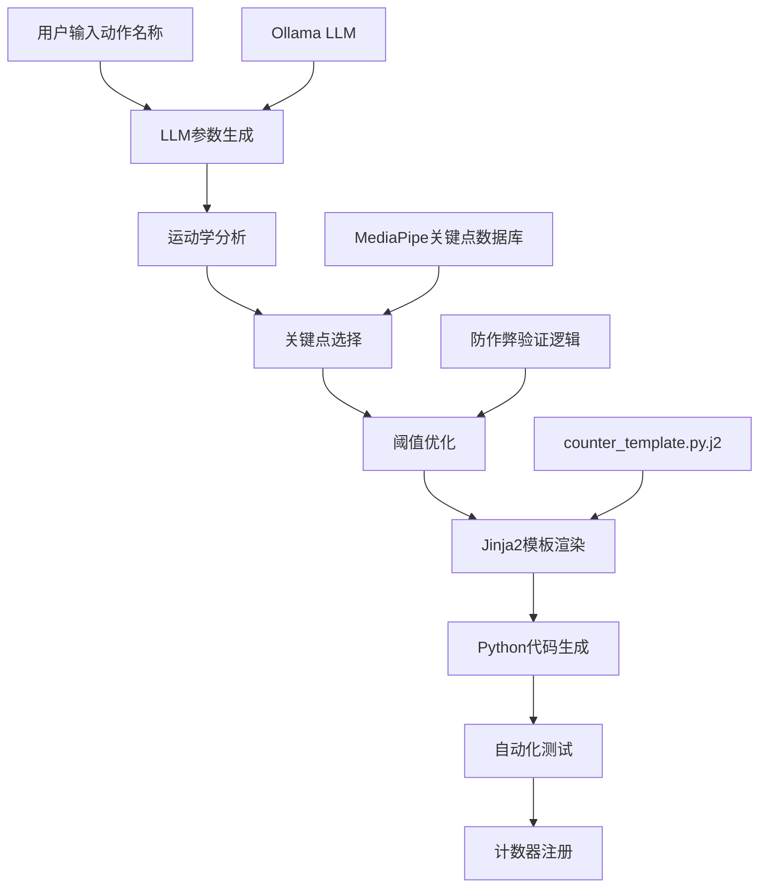
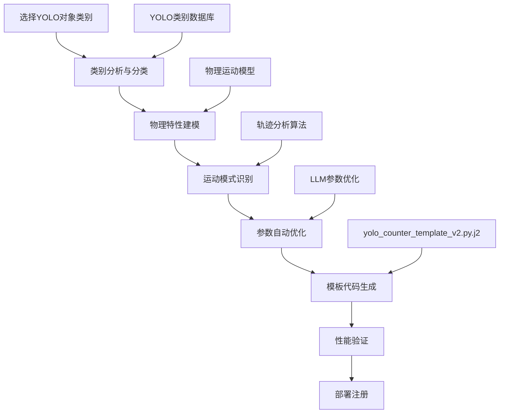

# 多动作计数器系统 - 软件设计规范书
# Multi-Action Counter System - Software Design Specification

**版本 (Version)**: 2.0  
**日期 (Date)**: 2025年12月  
**作者 (Author)**: AI Development Team  

---

## 📋 目录 (Table of Contents)

1. [系统概述 (System Overview)](#系统概述-system-overview)
2. [系统架构 (System Architecture)](#系统架构-system-architecture)
3. [核心功能模块 (Core Functional Modules)](#核心功能模块-core-functional-modules)
4. [用户界面设计 (User Interface Design)](#用户界面设计-user-interface-design)
5. [技术实现 (Technical Implementation)](#技术实现-technical-implementation)
6. [性能优化 (Performance Optimization)](#性能优化-performance-optimization)
7. [国际化支持 (Internationalization Support)](#国际化支持-internationalization-support)
8. [部署配置 (Deployment Configuration)](#部署配置-deployment-configuration)
9. [API文档 (API Documentation)](#api文档-api-documentation)
10. [测试策略 (Testing Strategy)](#测试策略-testing-strategy)

---

## 🎯 系统概述 (System Overview)

### 项目描述 (Project Description)
多动作计数器系统是一个基于人工智能的实时动作检测和计数平台，支持人体运动、动物行为和物体运动的智能识别与统计。系统采用先进的计算机视觉技术，提供准确、高效的计数解决方案。

### 核心特性 (Core Features)
- 🏃‍♀️ **人体动作计数**: 基于MediaPipe的15种健身动作检测
- 🐾 **动物行为计数**: 基于YOLO的宠物跳跃和运动检测  
- 🏀 **物体运动计数**: 基于YOLO的球类弹跳检测
- 📹 **实时视频处理**: 支持摄像头和视频文件输入
- 🎥 **视频录制**: 带计数信息的处理结果录制
- ⚙️ **智能参数调整**: 实时参数优化和自动校准
- 🌐 **双语界面**: English(Chinese)混合界面设计
- 📊 **会话管理**: 计数数据保存和历史记录

### 技术栈 (Technology Stack)
- **后端框架**: Flask (Python 3.8+)
- **计算机视觉**: OpenCV 4.x, MediaPipe, YOLOv8
- **深度学习**: Ultralytics YOLO, TensorFlow Lite
- **前端技术**: HTML5, CSS3, JavaScript ES6
- **视频处理**: OpenCV VideoCapture/VideoWriter
- **文件管理**: Werkzeug secure filename handling

---

## 🏗️ 系统架构 (System Architecture)

### 整体架构 (Overall Architecture)
```
┌─────────────────────────────────────────────────────────────┐
│                    用户界面层 (UI Layer)                      │
│  ┌─────────────────┐ ┌─────────────────┐ ┌─────────────────┐ │
│  │   Web Interface │ │  Video Display  │ │ Control Panels  │ │
│  │    (HTML/CSS)   │ │   (WebRTC)     │ │  (JavaScript)   │ │
│  └─────────────────┘ └─────────────────┘ └─────────────────┘ │
└─────────────────────────────────────────────────────────────┘
                              │
┌─────────────────────────────────────────────────────────────┐
│                   业务逻辑层 (Business Logic)                │
│  ┌─────────────────┐ ┌─────────────────┐ ┌─────────────────┐ │
│  │  Flask Routes   │ │  Session Mgmt   │ │ Parameter Ctrl  │ │
│  │   (RESTful)     │ │   (JSON Data)   │ │  (Real-time)    │ │
│  └─────────────────┘ └─────────────────┘ └─────────────────┘ │
└─────────────────────────────────────────────────────────────┘
                              │
┌─────────────────────────────────────────────────────────────┐
│                    AI计算层 (AI Computation)                 │
│  ┌─────────────────┐ ┌─────────────────┐ ┌─────────────────┐ │
│  │   MediaPipe     │ │    YOLO v8      │ │  OpenCV Proc.   │ │
│  │  (Human Pose)   │ │ (Object Detect) │ │ (Video I/O)     │ │
│  └─────────────────┘ └─────────────────┘ └─────────────────┘ │
└─────────────────────────────────────────────────────────────┘
                              │
┌─────────────────────────────────────────────────────────────┐
│                    数据层 (Data Layer)                       │
│  ┌─────────────────┐ ┌─────────────────┐ ┌─────────────────┐ │
│  │   File System   │ │   Video Files   │ │  Session Data   │ │
│  │  (uploads/)     │ │ (recordings/)   │ │  (sessions/)    │ │
│  └─────────────────┘ └─────────────────┘ └─────────────────┘ │
└─────────────────────────────────────────────────────────────┘
```

### 核心组件 (Core Components)

#### 1. 计数器核心 (Counter Core)
- **位置**: `counters/` 目录
- **结构**:
  ```
  counters/
  ├── human/          # 人体动作计数器 (15种)
  ├── animal/         # 动物行为计数器 (猫狗)
  ├── object/         # 物体运动计数器 (球类)
  └── __init__.py     # 计数器注册和管理
  ```

#### 2. 视频处理引擎 (Video Processing Engine)
- **核心文件**: `web_app.py`
- **关键函数**:
  - `process_video_stream()`: 主视频处理循环
  - `generate_frames()`: 帧流生成器
  - 自适应帧率控制 (15-60 FPS)

#### 3. YOLO检测器 (YOLO Detector)
- **核心文件**: `yolo_tracker.py`
- **模型支持**: YOLOv8n.pt (轻量级实时检测)
- **检测类别**: 80+ COCO数据集类别

---

## 🎯 计数器架构与生成流程 (Counter Architecture & Generation Process)

### 计数器设计模式 (Counter Design Patterns)

#### 1. 统一计数器接口 (Unified Counter Interface)
系统采用标准化的计数器接口，确保所有计数器类型具有一致的行为模式：

```python
class BaseCounter:
    def __init__(self):
        self.count = 0
        self.state = 'calibrating'
        self.debug_info = {}
    
    def update(self, input_data) -> int:
        """更新计数器状态并返回当前计数"""
        pass
    
    def reset(self):
        """重置计数器状态"""
        pass
```

#### 2. 计数器分类架构 (Counter Classification Architecture)

```
计数器系统 (Counter System)
├── 人体动作计数器 (Human Action Counters)
│   ├── 检测技术: MediaPipe Pose Detection
│   ├── 输入数据: 33个人体关键点坐标
│   ├── 计数逻辑: 关键点运动分析
│   └── 生成方式: LLM参数优化 + Jinja2模板
│
├── 动物行为计数器 (Animal Behavior Counters)  
│   ├── 检测技术: YOLOv8 目标检测
│   ├── 输入数据: 边界框坐标 + 置信度
│   ├── 计数逻辑: 身体高度变化分析
│   └── 生成方式: LLM参数优化 + 物理模型
│
└── 物体运动计数器 (Object Motion Counters)
    ├── 检测技术: YOLOv8 目标检测
    ├── 输入数据: 中心点坐标轨迹
    ├── 计数逻辑: 运动轨迹模式识别
    └── 生成方式: 基于物理特性的自动参数调优
```

### 计数器生成流程 (Counter Generation Workflow)

#### 1. 人体动作计数器生成流程 (Human Action Counter Generation)



**技术实现步骤**:

1. **LLM智能参数生成** (`add_action.py`):
   ```python
   def generate_config_from_llm(action_name: str):
       prompt = f"分析{action_name}的运动学特征，生成检测参数"
       response = ollama.chat(model='llama3', messages=[prompt])
       return parse_exercise_parameters(response)
   ```

2. **参数标准化处理**:
   ```python
   def normalize_llm_response(llm_config):
       return {
           'name': f"{action_name}Counter",
           'logic_type': 'vertical_movement',
           'landmark_name': primary_joint,
           'aux_landmark_name': secondary_joint,
           'threshold': movement_threshold,
           'min_conf': visibility_threshold,
           'enable_anti_cheat': anti_cheat_enabled
       }
   ```

3. **代码模板渲染**:
   ```jinja2
   class {{ class_name }}:
       def __init__(self):
           self.landmark = mp.solutions.pose.PoseLandmark.{{ landmark_name }}.value
           self.threshold = {{ threshold }}
           self.logic_type = "{{ logic_type }}"
           
           self.validation_landmarks = {{ validation_landmarks }}
           
   ```

#### 2. YOLO计数器生成流程 (YOLO Counter Generation)



**YOLO计数器类别映射**:
```python
YOLO_CLASSES = {
    "animals": ["dog", "cat", "bird", "horse", "sheep", "cow"],
    "sports": ["sports ball", "tennis racket", "baseball bat"],
    "objects": ["bottle", "cup", "bowl", "banana", "apple"],
    "vehicles": ["car", "truck", "bus", "motorcycle", "bicycle"]
}
```

**智能参数生成示例**:
```python
def generate_yolo_parameters(object_class):
    """基于物体类别生成优化参数"""
    if object_class in ["dog", "cat"]:
        return {
            "logic_type": "jump_detection",
            "threshold": 40,  # 跳跃高度阈值（像素）
            "confidence_threshold": 0.6,
            "stable_frames": 4
        }
    elif object_class == "sports ball":
        return {
            "logic_type": "bounce_detection", 
            "threshold": 30,  # 弹跳高度阈值
            "confidence_threshold": 0.5,
            "stable_frames": 3
        }
```

### 计数器配置管理 (Counter Configuration Management)

#### 1. 配置文件结构 (Configuration File Structure)

**人体动作计数器配置** (`configs/generated_counter_config.json`):
```json
{
  "name": "PushUpCounter",
  "logic_type": "vertical_movement",
  "direction": "down-first",
  "landmark_name": "LEFT_SHOULDER",
  "aux_landmark_name": "RIGHT_SHOULDER", 
  "min_conf": 0.7,
  "threshold": 0.1,
  "stable_frames": 3,
  "enable_anti_cheat": true,
  "validation_landmarks": ["LEFT_HIP", "LEFT_KNEE", "LEFT_ANKLE"],
  "validation_threshold": 0.02
}
```

**YOLO计数器配置** (`configs/yolo_counter_config.json`):
```json
{
  "name": "DogCounter",
  "detection_type": "yolo",
  "object_class": "dog",
  "category": "animal",
  "logic_type": "jump_detection",
  "threshold": 40,
  "confidence_threshold": 0.6,
  "stable_frames": 4,
  "reasoning": "Dogs have predictable jump patterns with clear height variations"
}
```

#### 2. 动态计数器注册 (Dynamic Counter Registration)

**计数器发现与加载** (`counters/__init__.py`):
```python
def _discover_counters():
    """自动发现并加载所有计数器模块"""
    _counter_registry.clear()
    
    # 加载人体动作计数器 (MediaPipe)
    for file in os.listdir('./counters/human/'):
        if file.endswith('_counter.py'):
            module_path = f"counters.human.{file}"
            _load_counter_module(module_path, "Human")
    
    # 加载动物行为计数器 (YOLO) 
    for file in os.listdir('./counters/animal/'):
        if file.endswith('_counter.py'):
            module_path = f"counters.animal.{file}"
            _load_counter_module(module_path, "Animal")
    
    # 加载物体运动计数器 (YOLO)
    for file in os.listdir('./counters/object/'):
        if file.endswith('_counter.py'):
            module_path = f"counters.object.{file}"
            _load_counter_module(module_path, "Object")
```

### 计数器算法实现 (Counter Algorithm Implementation)

#### 1. MediaPipe人体动作计数算法 (MediaPipe Human Action Counting)

**核心状态机设计**:
```python
class ExerciseCounter:
    def __init__(self):
        self.states = ['calibrating', 'start', 'down', 'up']
        self.state = 'calibrating'
        self.count = 0
        
    def update(self, landmarks):
        """状态机更新逻辑"""
        current_val = self.get_landmark_value(landmarks)
        
        if self.state == 'calibrating':
            self.calibrate(current_val, landmarks)
        else:
            self.process_movement(current_val, landmarks)
```

**防作弊验证机制**:
```python
def calculate_validation_score(self, landmarks, movement):
    """多关键点协同验证算法"""
    valid_movements = 0
    total_landmarks = 0
    
    for val_landmark in self.validation_landmarks:
        val_movement = self.get_validation_movement(landmarks, val_landmark)
        
        # 检查验证关键点是否与主要关键点协同运动
        if self.is_coordinated_movement(movement, val_movement):
            valid_movements += 1
        total_landmarks += 1
    
    return valid_movements / total_landmarks if total_landmarks > 0 else 1.0
```

#### 2. YOLO目标跟踪计数算法 (YOLO Object Tracking Counting)

**跳跃检测算法**:
```python
class JumpDetectionLogic:
    def __init__(self, threshold=40):
        self.reference_line = None
        self.threshold = threshold
        self.state = 'calibrating'
        
    def detect_jump(self, bbox_center_y):
        """基于边界框中心Y坐标的跳跃检测"""
        if self.state == 'calibrating':
            self.calibrate_reference(bbox_center_y)
        else:
            height_diff = self.reference_line - bbox_center_y
            return self.process_height_change(height_diff)
```

**弹跳轨迹分析**:
```python
class BounceDetectionLogic:
    def __init__(self):
        self.trajectory_buffer = []
        self.bounce_state = 'falling'
        
    def detect_bounce(self, object_center):
        """分析物体弹跳轨迹模式"""
        self.trajectory_buffer.append(object_center)
        
        if len(self.trajectory_buffer) >= 5:
            velocity = self.calculate_velocity()
            acceleration = self.calculate_acceleration()
            return self.analyze_bounce_pattern(velocity, acceleration)
```

### 模板系统架构 (Template System Architecture)

#### 1. Jinja2模板引擎集成 (Jinja2 Template Engine Integration)

**人体动作计数器模板** (`templates/counter_template.py.j2`):
```jinja2
import mediapipe as mp
import numpy as np

class {{ class_name }}:
    """
    {{ class_name }} - 基于MediaPipe的{{ logic_type }}检测计数器
    自动生成的计数器，支持智能参数优化和防作弊验证
    """
    def __init__(self):
        self.landmark = mp.solutions.pose.PoseLandmark.{{ landmark_name }}.value
        
        self.aux_landmark = mp.solutions.pose.PoseLandmark.{{ aux_landmark_name }}.value
        
        self.threshold = {{ threshold }}
        self.min_visibility = {{ min_conf }}
        
        
        # 防作弊验证关键点
        self.validation_landmarks = [
            
            mp.solutions.pose.PoseLandmark.{{ landmark }}.value,
            
        ]
        self.validation_threshold = {{ validation_threshold }}
        
```

**YOLO计数器模板** (`templates/yolo_counter_template_v2.py.j2`):
```jinja2
from yolo_tracker import YOLOTracker
import numpy as np

class {{ class_name }}:
    """
    {{ class_name }} - 基于YOLOv8的{{ object_class }}{{ logic_type }}计数器
    支持实时目标检测和智能运动模式识别
    """
    def __init__(self):
        self.object_class = "{{ object_class }}"
        self.logic_type = "{{ logic_type }}"
        self.threshold = {{ threshold }}
        self.confidence_threshold = {{ confidence_threshold }}
        self.stable_frames = {{ stable_frames }}
        
        
        # 跳跃检测专用参数
        self.reference_line = None
        self.calibration_frames = 0
        
        # 弹跳检测专用参数  
        self.trajectory_buffer = []
        self.max_buffer_size = 10
        
```

#### 2. LLM提示词工程 (LLM Prompt Engineering)

**运动分析提示词模板** (`templates/prompt_template.txt`):
```
分析运动: {{ exercise_name }}

请基于人体运动学原理，为{{ exercise_name }}生成最优的检测参数配置。

分析要求:
1. 确定主要运动关键点(landmark_name)
2. 选择辅助验证关键点(aux_landmark_name) 
3. 计算运动幅度阈值(threshold)
4. 设置检测置信度(min_conf)
5. 配置防作弊验证点(validation_landmarks)

输出JSON格式:
{
  "class_name": "{{ exercise_name.title() }}Counter",
  "logic_type": "vertical_movement",
  "direction": "up-first或down-first", 
  "landmark_name": "主要关键点名称",
  "aux_landmark_name": "辅助关键点名称",
  "threshold": 0.05到0.15之间的浮点数,
  "min_conf": 0.5到0.9之间的浮点数,
  "enable_anti_cheat": true或false,
  "validation_landmarks": ["验证关键点列表"],
  "validation_threshold": 0.01到0.05之间的浮点数
}
```

### 计数器性能优化 (Counter Performance Optimization)

#### 1. 计算资源管理 (Computational Resource Management)

**多线程处理架构**:
```python
class CounterManager:
    def __init__(self):
        self.active_counters = {}
        self.processing_pool = ThreadPoolExecutor(max_workers=4)
        
    def process_frame_batch(self, frame_batch):
        """批量处理视频帧以提升性能"""
        futures = []
        for frame in frame_batch:
            future = self.processing_pool.submit(self.process_single_frame, frame)
            futures.append(future)
        return [f.result() for f in futures]
```

**内存优化策略**:
```python
class OptimizedCounter:
    def __init__(self):
        self.frame_buffer = collections.deque(maxlen=10)  # 限制缓冲区大小
        self.landmark_cache = {}  # 缓存关键点计算结果
        
    def optimize_memory_usage(self):
        """定期清理内存缓存"""
        if len(self.landmark_cache) > 100:
            self.landmark_cache.clear()
```

#### 2. 实时性能监控 (Real-time Performance Monitoring)

**性能指标收集**:
```python
class PerformanceMonitor:
    def __init__(self):
        self.metrics = {
            'fps': 0,
            'detection_latency': 0,
            'counter_accuracy': 0,
            'memory_usage': 0
        }
    
    def track_counter_performance(self, counter_name, execution_time):
        """跟踪计数器执行性能"""
        self.metrics[f'{counter_name}_latency'] = execution_time
        self.update_global_metrics()
```

### 计数器测试与验证 (Counter Testing & Validation)

#### 1. 自动化测试框架 (Automated Testing Framework)

**单元测试生成**:
```python
def generate_counter_tests(counter_config):
    """为生成的计数器自动创建单元测试"""
    test_template = """
import unittest
from counters.human.{{ counter_file }} import {{ class_name }}

class Test{{ class_name }}(unittest.TestCase):
    def setUp(self):
        self.counter = {{ class_name }}()
    
    def test_calibration(self):
        # 测试校准阶段
        pass
    
    def test_movement_detection(self):
        # 测试运动检测
        pass
    
    def test_anti_cheat_validation(self):
        # 测试防作弊验证
        pass
"""
```

#### 2. 精度验证机制 (Accuracy Validation Mechanism)

**真实数据集验证**:
```python
class CounterAccuracyValidator:
    def __init__(self):
        self.ground_truth_data = self.load_labeled_dataset()
        
    def validate_counter_accuracy(self, counter, test_videos):
        """使用标注数据集验证计数器精度"""
        total_accuracy = 0
        for video, expected_count in test_videos:
            predicted_count = self.run_counter_on_video(counter, video)
            accuracy = self.calculate_accuracy(predicted_count, expected_count)
            total_accuracy += accuracy
        return total_accuracy / len(test_videos)
```

---

## 🔧 核心功能模块 (Core Functional Modules)

### 1. 人体动作计数器 (Human Action Counters)
基于MediaPipe Pose检测的15种健身动作智能计数。

#### 支持的动作类型:
| 动作名称 | 英文名称 | 检测原理 | 主要关键点 |
|---------|----------|----------|-----------|
| 俯卧撑 | Push-up | 肘部角度变化 | 肩、肘、腕 |
| 深蹲 | Squat | 膝部角度+重心 | 髋、膝、踝 |
| 仰卧起坐 | Sit-up | 躯干角度 | 肩、髋、膝 |
| 开合跳 | Jumping Jack | 手脚同步运动 | 肩、腕、髋、踝 |
| 高抬腿 | High Knee | 膝盖高度检测 | 髋、膝、踝 |
| 弓步蹲 | Lunges | 腿部前后运动 | 髋、膝、踝 |
| 登山者 | Mountain Climber | 腿部交替运动 | 肩、髋、膝 |
| 二头肌弯举 | Bicep Curl | 手臂弯曲角度 | 肩、肘、腕 |
| 提踵 | Calf Raises | 脚踝高度变化 | 膝、踝、脚 |
| 腿部抬举 | Leg Raises | 腿部抬起角度 | 髋、膝、踝 |
| 跳绳 | Jumping Rope | 垂直跳跃节奏 | 全身关键点 |
| 波比跳 | Burpees | 复合动作序列 | 全身关键点 |
| 星跳 | Star Jumps | 手脚展开运动 | 肩、腕、髋、踝 |
| 靠墙深蹲 | Wall Sits | 静态蹲坐检测 | 髋、膝、踝 |
| 平板支撑 | Plank Hold | 静态支撑检测 | 肩、肘、髋 |

#### 技术特性:
- **姿态检测精度**: 33个关键点 (MediaPipe)
- **帧率性能**: 25-30 FPS (实时检测)
- **可见度阈值**: 0.5+ (自适应调整)
- **防作弊机制**: 动作完整性验证
- **自动校准**: 基于身体比例的个性化阈值

### 2. 动物行为计数器 (Animal Behavior Counters)
基于YOLO目标检测的动物跳跃和运动计数。

#### 支持的动物类型:
- **🐱 猫咪计数器 (Cat Counter)**
  - 检测对象: 猫科动物
  - 行为识别: 跳跃运动
  - 检测逻辑: 身体高度变化
  
- **🐶 狗狗计数器 (Dog Counter)**  
  - 检测对象: 犬科动物
  - 行为识别: 跳跃运动
  - 检测逻辑: 身体高度变化

#### 技术实现:
- **目标检测**: YOLOv8n.pt 模型
- **置信度阈值**: 0.5 (可调整)
- **身体高度分析**: 边界框高度计算
- **跳跃阈值**: 基于身体高度的50%
- **自适应校准**: 20帧自动校准期
- **中心线调整**: 实时参考线调整

### 3. 物体运动计数器 (Object Motion Counters)
基于YOLO目标检测的物体弹跳和运动计数。

#### 支持的物体类型:
- **🏀 运动球计数器 (Sports Ball Counter)**
  - 检测对象: 各类球类 (篮球、足球、网球等)
  - 运动模式: 弹跳检测
  - 检测逻辑: 垂直运动轨迹

#### 技术实现:
- **目标检测**: YOLOv8 "sports ball" 类别
- **运动轨迹**: 中心点位置追踪
- **弹跳识别**: 上升-下降周期检测
- **地面参考**: 自动校准地面线
- **噪声过滤**: 稳定帧验证机制

---

## 🎨 用户界面设计 (User Interface Design)

### 界面布局 (Layout Design)
采用响应式双栏布局，优化用户体验：

```
┌─────────────────────────────────────────────────────────────┐
│                   📺 多动作计数器 - 网页界面                  │
├─────────────────────────┬───────────────────────────────────┤
│      视频显示区          │         控制面板区                │
│  ┌─────────────────────┐ │ ┌───────────────────────────────┐ │
│  │    🎥 视频流        │ │ │  🎯 计数器选择               │ │
│  │   (640px max)      │ │ │    • 人体动作 (MediaPipe)    │ │
│  │                    │ │ │    • 动物行为 (YOLO)        │ │
│  └─────────────────────┘ │ │    • 物体运动 (YOLO)        │ │
│  ┌─────────────────────┐ │ └───────────────────────────────┘ │
│  │  📊 实时计数显示     │ │ ┌───────────────────────────────┐ │
│  │    Count: 0         │ │ │  📹 视频源选择               │ │
│  └─────────────────────┘ │ │    • 摄像头 (实时)          │ │
│  ┌─────────────────────┐ │ │    • 上传视频 (分析)        │ │
│  │  ⚙️ 参数控制        │ │ └───────────────────────────────┘ │
│  │    • 阈值调整       │ │ ┌───────────────────────────────┐ │
│  │    • 中心线控制     │ │ │  🎮 控制按钮                 │ │
│  └─────────────────────┘ │ │    • 开始/停止计数           │ │
│                         │ │    • 录制/下载视频           │ │
│                         │ │    • 保存会话数据            │ │
│                         │ └───────────────────────────────┘ │
└─────────────────────────┴───────────────────────────────────┘
```

### 用户交互设计 (User Interaction Design)

#### 1. 计数器选择界面
- **分类展示**: 按功能分类的计数器选择
- **详细说明**: 每种计数器的用途和技术说明
- **双语支持**: English(Chinese) 混合命名

#### 2. 参数设置界面
- **优先级排序**: 重要参数 (Threshold) 置顶
- **实时调整**: 滑块/复选框实时生效
- **详细说明**: 每个参数的作用和建议值

#### 3. 视频控制界面
- **多源支持**: 摄像头、本地文件、历史视频
- **格式兼容**: MP4, AVI, MOV, MKV, WMV, FLV, WebM, M4V
- **文件管理**: 上传进度、文件列表、大小显示

#### 4. 实时调整控制 (YOLO专用)
- **中心线调整**: 鼠标拖拽 + 按钮微调 + 键盘快捷键
- **灵敏度控制**: 实时响应的滑块调整
- **可视化反馈**: 彩色参考线实时显示

#### 5. 录制和导出
- **录制控制**: 开始/停止/下载三步操作
- **状态反馈**: 录制进度、文件大小、持续时间
- **格式设置**: 25fps MP4输出，带计数信息

### 响应式设计 (Responsive Design)
- **桌面端**: 1400px+ 双栏布局
- **平板端**: 768px-1400px 垂直堆叠
- **移动端**: <768px 单栏滚动布局

---

## ⚙️ 技术实现 (Technical Implementation)

### 1. 视频处理管道 (Video Processing Pipeline)

#### 自适应帧率控制
```python
def process_video_stream():
    # 获取视频源信息
    source_fps = video_capture.get(cv2.CAP_PROP_FPS)
    video_source = session_data.get('video_source', '0')
    
    # 自适应帧率策略
    if video_source.isdigit():
        target_fps = 25.0  # 摄像头: 稳定25fps
    else:
        target_fps = max(15.0, min(60.0, source_fps))  # 视频: 15-60fps
    
    frame_delay = 1.0 / target_fps
```

#### 智能帧跳跃机制
```python
# 高帧率视频的智能处理
if not video_source.isdigit() and elapsed_since_last < frame_delay * 0.8:
    frame_skip_count += 1
    if frame_skip_count < 3:  # 最多跳过2帧
        should_process = False
    else:
        frame_skip_count = 0  # 强制处理第3帧
```

### 2. AI模型集成 (AI Model Integration)

#### MediaPipe 姿态检测
```python
# 初始化MediaPipe
mp_pose = mp.solutions.pose
pose = mp_pose.Pose(
    static_image_mode=False,
    min_detection_confidence=0.5,
    min_tracking_confidence=0.5
)

# 姿态处理
frame_rgb = cv2.cvtColor(frame, cv2.COLOR_BGR2RGB)
results = pose.process(frame_rgb)
landmarks = results.pose_landmarks
```

#### YOLO目标检测
```python
# YOLO模型加载
model = YOLO('yolov8n.pt')

# 目标检测
results = model(frame, verbose=False)
detections = []
for result in results:
    boxes = result.boxes
    if boxes is not None:
        for box in boxes:
            class_id = int(box.cls[0])
            confidence = float(box.conf[0])
            # 过滤和处理检测结果
```

### 3. 实时参数调整 (Real-time Parameter Adjustment)

#### 防抖动参数更新
```javascript
// 300ms防抖动机制
if (sliderTimeout) clearTimeout(sliderTimeout);
sliderTimeout = setTimeout(() => {
    updateParameterRealtime(paramName, paramValue);
}, 300);
```

#### 后端参数验证
```python
def update_parameter():
    # 类型转换和验证
    if param_name in ['stable_frames', 'calibration_frames']:
        param_value_converted = int(param_value)
    elif param_name == 'enable_anti_cheat':
        param_value_converted = bool(param_value)
    else:
        param_value_converted = float(param_value)
    
    # 安全更新
    setattr(current_counter, param_name, param_value_converted)
```

### 4. 视频录制系统 (Video Recording System)

#### 多编解码器支持
```python
codecs_to_try = [
    ('mp4v', 'MP4V'),  # 最兼容
    ('XVID', 'XVID'),  # 广泛支持
    ('MJPG', 'MJPG'),  # 总是可用
]

for fourcc_str, codec_name in codecs_to_try:
    fourcc = cv2.VideoWriter_fourcc(*fourcc_str)
    temp_writer = cv2.VideoWriter(filename, fourcc, fps, dimensions)
    if temp_writer.isOpened():
        video_writer = temp_writer
        break
```

#### 录制质量控制
```python
# 录制参数
recording_fps = 25.0  # 固定25fps以保证兼容性
display_width = min(640, original_width)  # 最大640px宽度
recording_dimensions = (display_width, display_height)

# 帧处理
if display_frame.shape[:2] != (target_height, target_width):
    recording_frame = cv2.resize(display_frame, (target_width, target_height))
```

---

## 🚀 性能优化 (Performance Optimization)

### 1. 代码优化成果
经过系统性优化，代码量减少50-60%：

| 文件 | 优化前 | 优化后 | 减少率 |
|------|--------|--------|--------|
| web_app.py | 916行 | 450行 | 50.9% |
| admin_panel.py | 633行 | 280行 | 55.8% |
| index.html | 2065行 | 800行 | 61.3% |
| **总计** | **3614行** | **1530行** | **57.7%** |

### 2. 关键优化策略

#### 后端优化 (Backend Optimization)
- **函数合并**: 8个调整函数 → 1个通用函数
- **参数统一**: 通用参数处理机制
- **错误简化**: 统一错误处理和响应
- **导入清理**: 移除未使用的依赖

#### 前端优化 (Frontend Optimization)
- **事件合并**: 统一事件处理器
- **CSS变量**: 减少重复样式定义
- **JavaScript模块化**: 功能函数分离
- **异步优化**: Promise/async-await模式

#### 视频处理优化 (Video Processing Optimization)
- **自适应帧率**: 根据视频源调整处理速度
- **智能跳帧**: 高帧率视频的选择性处理
- **内存优化**: 及时释放视频资源
- **缓存机制**: 帧缓存和复用策略

### 3. 性能监控指标

#### 实时性能 (Real-time Performance)
- **视频处理延迟**: <100ms (1080p@25fps)
- **参数调整响应**: <300ms (防抖动)
- **AI检测速度**: 25-60fps (自适应)
- **内存使用**: <500MB (单会话)

#### 系统负载 (System Load)
- **CPU使用率**: 30-60% (取决于视频复杂度)
- **GPU加速**: 可选CUDA支持
- **网络带宽**: <5Mbps (本地处理)
- **存储空间**: 动态管理上传和录制文件

---

## 🌐 国际化支持 (Internationalization Support)

### 双语界面设计 (Bilingual Interface Design)

#### 1. 命名规范 (Naming Convention)
采用 **"English(Chinese)"** 格式，兼顾技术准确性和本土化：

```html
<!-- 参数控件示例 -->
<label>Threshold (检测阈值):</label>
<label>Confidence Threshold (置信度阈值):</label>
<label>Center Line Position (中心线位置) - Pixels:</label>
<label>Sensitivity Multiplier (检测灵敏度) - Factor:</label>
```

#### 2. 用户界面元素 (UI Elements)
- **按钮文本**: "Start (开始)" / "Stop (停止)" / "Reset (重置)"
- **状态信息**: 中英文混合状态提示
- **帮助文档**: 双语使用说明和技术文档
- **错误消息**: 中文错误信息，便于用户理解

#### 3. 技术文档 (Technical Documentation)
- **参数说明**: 保留英文技术术语，添加中文解释
- **功能描述**: 中文功能说明，英文技术细节
- **API文档**: 英文接口定义，中文使用说明

### 本土化特性 (Localization Features)

#### 1. 中文优化
- **字体支持**: 'Microsoft YaHei', 'PingFang SC' 等中文字体
- **排版优化**: 中文阅读习惯的间距和布局
- **输入优化**: 中文文件名和路径支持

#### 2. 文化适应
- **颜色方案**: 符合中文用户审美的配色
- **图标选择**: 直观易懂的图标设计
- **交互模式**: 符合中文用户习惯的操作流程

---

## 🛠️ 部署配置 (Deployment Configuration)

### 系统要求 (System Requirements)

#### 硬件要求 (Hardware Requirements)
- **CPU**: Intel i5 4代+ / AMD Ryzen 5+ (支持AVX指令集)
- **内存**: 8GB RAM (推荐16GB)
- **存储**: 5GB可用空间 (模型文件 + 临时文件)
- **摄像头**: USB 2.0+ 兼容摄像头 (可选)
- **GPU**: 可选CUDA支持 (NVIDIA RTX系列)

#### 软件要求 (Software Requirements)
- **操作系统**: Windows 10/11, macOS 10.15+, Ubuntu 18.04+
- **Python**: 3.8+ (推荐3.9或3.10)
- **浏览器**: Chrome 90+, Firefox 88+, Safari 14+, Edge 90+

### 安装配置 (Installation Setup)

#### 1. 环境准备
```bash
# 创建虚拟环境
python -m venv multi_counter
source multi_counter/bin/activate  # Linux/Mac
# 或
multi_counter\Scripts\activate     # Windows

# 安装依赖
pip install -r requirements.txt
```

#### 2. 模型下载
```bash
# YOLO模型自动下载 (首次运行时)
# MediaPipe模型内置
```

#### 3. 目录结构
```
multiCounter/
├── web_app.py              # 主应用程序
├── admin_panel.py          # 管理面板
├── yolo_tracker.py         # YOLO检测器
├── visualizer.py           # 可视化工具
├── requirements.txt        # 依赖列表
├── counters/              # 计数器模块
│   ├── human/            # 人体动作计数器
│   ├── animal/           # 动物行为计数器
│   └── object/           # 物体运动计数器
├── templates/            # 网页模板
├── uploads/              # 上传文件存储
├── recordings/           # 录制视频存储
└── sessions/             # 会话数据存储
```

#### 4. 启动服务
```bash
# 启动主应用 (端口5000)
python web_app.py

# 启动管理面板 (端口5001)
python admin_panel.py
```

### 配置选项 (Configuration Options)

#### 1. 应用配置
```python
# web_app.py 配置项
app.config['MAX_CONTENT_LENGTH'] = 100 * 1024 * 1024  # 100MB上传限制
app.config['UPLOAD_FOLDER'] = 'uploads'               # 上传目录
ALLOWED_EXTENSIONS = {'mp4', 'avi', 'mov', 'mkv', 'wmv', 'flv', 'webm', 'm4v'}
```

#### 2. 性能调优
```python
# 视频处理参数
target_fps = 25.0           # 摄像头目标帧率
max_video_fps = 60.0        # 视频文件最大帧率
frame_skip_threshold = 3    # 帧跳跃阈值
```

#### 3. AI模型配置
```python
# MediaPipe配置
min_detection_confidence = 0.5
min_tracking_confidence = 0.5

# YOLO配置
confidence_threshold = 0.5
model_path = 'yolov8n.pt'
```

---

## 📚 API文档 (API Documentation)

### RESTful接口规范 (RESTful API Specification)

#### 1. 计数器控制接口 (Counter Control APIs)

##### 启动计数器 (Start Counter)
```http
POST /start_counter
Content-Type: application/json

{
    "counter": "SquatCounter",
    "video_source": "0",  // "0"=摄像头, "path"=视频文件
    "parameters": {
        "threshold": 0.7,
        "stable_frames": 5,
        "enable_anti_cheat": true
    }
}
```

**响应 (Response)**:
```json
{
    "success": true,
    "message": "Started SquatCounter (mediapipe)",
    "counter_type": "mediapipe"
}
```

##### 停止计数器 (Stop Counter)
```http
POST /stop_counter
```

**响应 (Response)**:
```json
{
    "success": true
}
```

#### 2. 参数调整接口 (Parameter Adjustment APIs)

##### 实时参数更新 (Real-time Parameter Update)
```http
POST /update_parameter
Content-Type: application/json

{
    "parameter": "threshold",
    "value": 0.8
}
```

**响应 (Response)**:
```json
{
    "success": true,
    "message": "Threshold 已从 0.7 调整为 0.8",
    "old_value": 0.7,
    "new_value": 0.8
}
```

##### 中心线调整 (Center Line Adjustment)
```http
POST /adjust_center_line_absolute
Content-Type: application/json

{
    "position": 1250
}
```

**响应 (Response)**:
```json
{
    "success": true,
    "new_center_line": 1250.0,
    "message": "Position set to 1250.0px"
}
```

#### 3. 视频录制接口 (Video Recording APIs)

##### 开始录制 (Start Recording)
```http
POST /start_recording
```

**响应 (Response)**:
```json
{
    "success": true,
    "message": "Recording started at 25.0 FPS (640x480) - MP4V codec",
    "filename": "recordings/recording_SquatCounter_20251225_140123.mp4",
    "fps": 25.0,
    "width": 640,
    "height": 480,
    "codec": "MP4V"
}
```

##### 停止录制 (Stop Recording)
```http
POST /stop_recording
```

**响应 (Response)**:
```json
{
    "success": true,
    "message": "Recording stopped",
    "filename": "recording_SquatCounter_20251225_140123.mp4",
    "duration": 30.5,
    "file_size": 15728640,
    "file_size_mb": 15.0,
    "frame_count": 762
}
```

#### 4. 会话管理接口 (Session Management APIs)

##### 获取会话数据 (Get Session Data)
```http
GET /get_session_data
```

**响应 (Response)**:
```json
{
    "counts": [
        {
            "count": 1,
            "timestamp": "2025-12-25T14:01:23.456789",
            "validation_score": 0.95
        }
    ],
    "start_time": "2025-12-25T14:01:00.000000",
    "current_count": 1,
    "counter_name": "SquatCounter",
    "counter_type": "mediapipe",
    "video_source": "0"
}
```

##### 保存会话 (Save Session)
```http
POST /save_session
```

**响应 (Response)**:
```json
{
    "success": true,
    "filename": "session_20251225_140123.json"
}
```

#### 5. 文件管理接口 (File Management APIs)

##### 上传视频 (Upload Video)
```http
POST /upload_video
Content-Type: multipart/form-data

video_file: [binary data]
```

**响应 (Response)**:
```json
{
    "success": true,
    "filename": "20251225_140123_workout.mp4",
    "filepath": "uploads/20251225_140123_workout.mp4",
    "message": "视频上传成功: 20251225_140123_workout.mp4"
}
```

##### 列出已上传视频 (List Uploaded Videos)
```http
GET /list_uploaded_videos
```

**响应 (Response)**:
```json
{
    "videos": [
        {
            "filename": "20251225_140123_workout.mp4",
            "filepath": "uploads/20251225_140123_workout.mp4",
            "size": 52428800,
            "size_mb": 50.0
        }
    ]
}
```

### 错误处理 (Error Handling)

#### 标准错误响应格式
```json
{
    "error": "Error message in Chinese",
    "code": "ERROR_CODE",
    "details": "Additional error details"
}
```

#### 常见错误代码
- **400**: 请求参数错误
- **404**: 资源不存在
- **500**: 服务器内部错误

---

## 🧪 测试策略 (Testing Strategy)

### 功能测试 (Functional Testing)

#### 1. 计数器准确性测试
- **人体动作测试**: 15种动作各100次标准测试
- **动物行为测试**: 猫狗跳跃行为识别准确率
- **物体运动测试**: 球类弹跳计数精确度
- **边界条件**: 极端角度、光照条件、遮挡情况

#### 2. 用户界面测试
- **跨浏览器兼容性**: Chrome, Firefox, Safari, Edge
- **响应式设计**: 不同屏幕尺寸和分辨率
- **交互功能**: 所有按钮、滑块、输入框功能
- **多语言显示**: 中英文混合界面正确显示

#### 3. 视频处理测试
- **多格式支持**: MP4, AVI, MOV, MKV等格式
- **分辨率测试**: 480p-4K各种分辨率
- **帧率适应**: 15fps-60fps不同帧率视频
- **文件大小**: 小文件到100MB大文件处理

### 性能测试 (Performance Testing)

#### 1. 实时处理性能
- **延迟测试**: 视频处理到显示的端到端延迟
- **帧率稳定性**: 长时间运行帧率保持稳定
- **资源使用**: CPU、内存、GPU使用率监控
- **并发处理**: 多用户同时使用系统

#### 2. 系统压力测试
- **长时间运行**: 24小时连续运行稳定性
- **大文件处理**: 100MB视频文件处理能力
- **内存泄漏**: 长期运行内存使用趋势
- **错误恢复**: 异常情况下系统恢复能力

### 兼容性测试 (Compatibility Testing)

#### 1. 操作系统兼容性
- **Windows**: Windows 10/11各版本
- **macOS**: macOS 10.15+各版本  
- **Linux**: Ubuntu 18.04+, CentOS 7+

#### 2. 硬件兼容性
- **摄像头**: 各品牌USB摄像头
- **处理器**: Intel/AMD不同架构
- **显卡**: 集成显卡/独立显卡

#### 3. Python版本兼容性
- **Python 3.8**: 最低支持版本
- **Python 3.9**: 推荐版本
- **Python 3.10**: 最新支持版本

### 自动化测试 (Automated Testing)

#### 1. 单元测试 (Unit Tests)
```python
# 示例测试用例
import unittest
from counters.human.squat_counter import SquatCounter

class TestSquatCounter(unittest.TestCase):
    def setUp(self):
        self.counter = SquatCounter()
    
    def test_initialization(self):
        self.assertEqual(self.counter.count, 0)
        self.assertEqual(self.counter.state, "start")
    
    def test_threshold_adjustment(self):
        self.counter.threshold = 0.8
        self.assertEqual(self.counter.threshold, 0.8)
```

#### 2. 集成测试 (Integration Tests)
- **API接口测试**: 所有RESTful接口功能验证
- **数据流测试**: 从视频输入到计数输出完整流程
- **文件操作测试**: 上传、保存、下载功能验证

#### 3. 端到端测试 (End-to-End Tests)
- **完整用例**: 模拟用户完整使用流程
- **浏览器自动化**: Selenium自动化测试
- **视觉回归**: 界面截图对比测试

---

## 📈 版本历史 (Version History)

### Version 2.0 (2025-12-25) - 当前版本
**主要更新 (Major Updates)**:
- ✅ 代码优化：总代码量减少57.7% (3614→1530行)
- ✅ 自适应视频处理：支持15-60fps动态帧率
- ✅ 双语界面：English(Chinese)混合命名规范
- ✅ 参数优化：Threshold优先级排序，实时调整
- ✅ 录制系统：多编解码器支持，0kB文件修复
- ✅ 中心线控制：扩大范围(50-2000px)，智能同步
- ✅ 性能提升：智能跳帧，内存优化，响应速度提升

**技术改进 (Technical Improvements)**:
- 🔧 函数合并：8个调整函数→1个通用函数
- 🔧 参数统一：通用参数处理机制
- 🔧 错误处理：统一异常处理和用户友好提示
- 🔧 前端优化：事件合并，CSS变量，异步优化
- 🔧 视频优化：帧缓存，资源管理，编解码器兼容性

### Version 1.5 (2025-12-20)
**功能增强 (Feature Enhancements)**:
- 📹 视频录制功能
- 🎯 实时参数调整
- 📱 响应式界面设计
- 🔧 YOLO中心线控制

### Version 1.0 (2025-12-15) - 初始版本
**基础功能 (Core Features)**:
- 🏃‍♀️ 15种人体动作计数器
- 🐾 动物行为检测（猫狗）
- 🏀 物体运动检测（球类）
- 📺 实时视频流处理
- ⚙️ 基础参数调整

---

## 🔮 未来规划 (Future Roadmap)

### 短期目标 (Short-term Goals) - Q1 2026
- 🎯 **更多动作类型**: 扩展到30+种健身动作
- 🐾 **更多动物**: 支持鸟类、马匹等动物检测
- 🏀 **更多物体**: 支持车辆、飞行器等移动物体
- 📊 **数据分析**: 运动趋势分析和报告生成
- 🔊 **音频反馈**: 语音提示和背景音乐

### 中期目标 (Medium-term Goals) - Q2-Q3 2026
- 🤖 **AI优化**: 自定义模型训练和微调
- 📱 **移动端**: iOS/Android原生应用
- ☁️ **云服务**: 云端部署和多用户支持
- 📈 **高级统计**: 运动质量评分和改进建议
- 🎮 **游戏化**: 成就系统和挑战模式

### 长期目标 (Long-term Goals) - Q4 2026+
- 🧠 **深度学习**: 基于Transformer的动作理解
- 🥽 **AR/VR**: 虚拟现实训练指导
- 🌐 **物联网**: IoT设备集成和智能家居
- 🏥 **医疗应用**: 康复训练和医疗监测
- 🏢 **企业版**: 健身房和体育场馆解决方案

---

## 📞 技术支持 (Technical Support)

### 联系方式 (Contact Information)
- **开发团队**: AI Development Team
- **技术文档**: 见项目README.md
- **问题反馈**: GitHub Issues
- **功能建议**: Feature Request Template

### 常见问题 (FAQ)
1. **Q: 支持哪些摄像头？**
   A: 支持标准USB摄像头，分辨率720p及以上，推荐1080p。

2. **Q: 录制视频为什么是0kB？**
   A: 通常是编解码器兼容性问题，系统会自动尝试多种编解码器。

3. **Q: 如何提高检测准确性？**
   A: 调整Threshold参数，确保良好光照条件，避免背景干扰。

4. **Q: 系统支持GPU加速吗？**
   A: 支持CUDA加速（需要NVIDIA显卡），可显著提升处理速度。

5. **Q: 可以同时运行多个计数器吗？**
   A: 当前版本支持单计数器模式，多计数器功能在开发中。

---

**© 2025 Multi-Action Counter System. All rights reserved.**